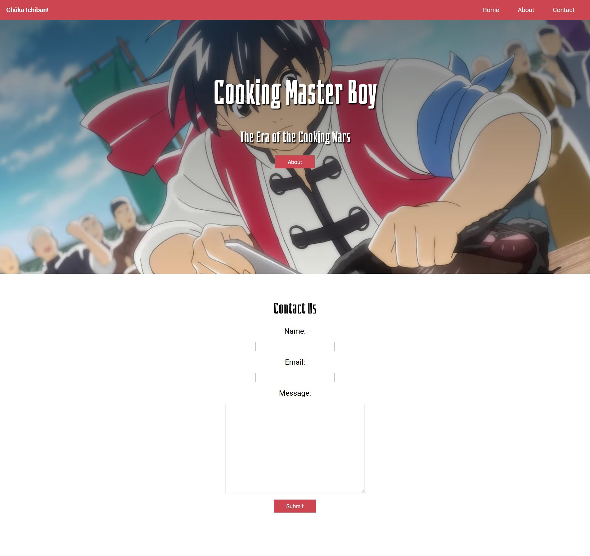

# float lecture and mini project

[The Creative HTML5 & CSS3 Course](https://developedbyed.com "developedbyed | Creative Programming")

We used floats to build this simple layout.  We won't be doing this in the future it was just a fun way of showing us what floating can do and it's severe limitations.

